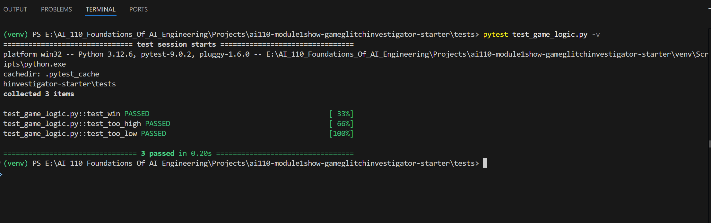
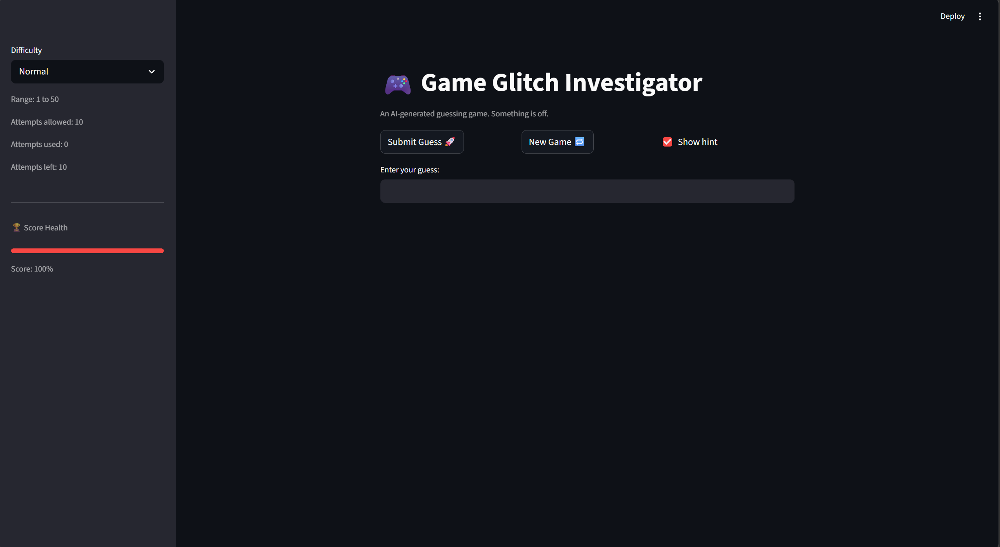
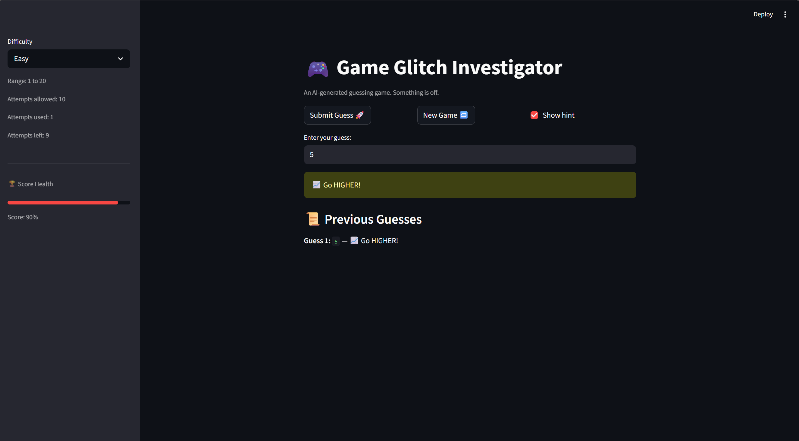

# 🎮 Game Glitch Investigator: The Impossible Guesser

## 🚨 The Situation

You asked an AI to build a simple "Number Guessing Game" using Streamlit.
It wrote the code, ran away, and now the game is unplayable. 

- You can't win.
- The hints lie to you.
- The secret number seems to have commitment issues.

## 🛠️ Setup

1. Install dependencies: `pip install -r requirements.txt`
2. Run the broken app: `python -m streamlit run app.py`

## 🕵️‍♂️ Your Mission

1. **Play the game.** Open the "Developer Debug Info" tab in the app to see the secret number. Try to win.
2. **Find the State Bug.** Why does the secret number change every time you click "Submit"? Ask ChatGPT: *"How do I keep a variable from resetting in Streamlit when I click a button?"*
3. **Fix the Logic.** The hints ("Higher/Lower") are wrong. Fix them.
4. **Refactor & Test.** - Move the logic into `logic_utils.py`.
   - Run `pytest` in your terminal.
   - Keep fixing until all tests pass!

## 📝 Document Your Experience

- [x] Describe the game's purpose.
- [x] Detail which bugs you found.
- [x] Explain what fixes you applied.

🎯 Game Purpose:
> Game Glitch Investigator is a number guessing game built with Streamlit where the player tries to guess a secret number within 10 attempts. It supports three difficulty levels — Easy (1–20), Normal (1–50), and Hard (1–100) — with optional higher/lower hints, a score that drains 10% per wrong guess, and a full guess history panel. The goal is to find the secret number in as few attempts as possible to finish with the highest score percentage.

🐛 Bugs Found:
> Bug 1 — Attempts counter always showed 0. The sidebar caption for "Attempts used" was rendered before the submit logic ran, so it always displayed the stale value from the previous rerun and never reflected the guess just submitted.
> Bug 2 — Guess history never displayed in the UI. The game was correctly storing each guess in game["history"] in session state, but there was no code in app.py to actually render that list on screen. Players had no way to review their previous guesses.
> Bug 3 — New Game button required two clicks and caused a phantom attempt. Clicking New Game once triggered a phantom attempt because Streamlit re-evaluated submit = True on the same rerun. The text input also retained its old value since the widget key never changed, so the input box was not cleared on the first click.
> Bug 4 — Score progress bar not draining correctly
Score started at 0 and the win bonus inflated it well above 100, making the progress bar misleading. A player with 7 wrong guesses who won on the 8th attempt would show a score far above 30%, misrepresenting their actual performance.
> Bug 5 — NameError crash when Show Hint was disabled, hint_msg was only assigned inside the if show_hint: block. When the checkbox was unchecked, hint_msg was never defined, causing a NameError crash when history.append tried to reference it.
> Bug 6 — Winning the game reset state on difficulty switch, st.stop() was halting the script before Streamlit could persist the finished game state. Switching difficulty after a win would lose the completed result and show a fresh game instead.

🔧 Fixes Applied:

> Moved "Attempts used" sidebar caption to after the submit block so it always reflects the current count on the same rerun
> Added guess history rendering at the bottom of app.py with the hint shown only if it was enabled at submission time
> Added game_id counter to session state and used it in the st.text_input key to force a widget remount on New Game, clearing the box in one click
> Added game["status"] == "playing" guard to the submit block to prevent phantom attempts on finished games. 
> New Game now resets all three difficulties, not just the current one
> Removed win bonus from update_score in logic_utils.py — score starts at 100 and drains exactly 10% per wrong guess, keeping it honest and in sync with the progress bar. 
> Always call check_guess before history.append so hint_msg is always defined regardless of the Show Hint setting
> Replaced st.stop() with a clean end-of-game message block rendered after the submit logic so game state persists correctly across difficulty switches

## 📸 Demo

- [x] [Insert a screenshot of your fixed, winning game here]

✅ Pytest Results — All Tests Passing:

### 🎮 Fixed Game in Action

## 🚀 Stretch Features

- [x] [If you choose to complete Challenge 4, insert a screenshot of your Enhanced Game UI here]
